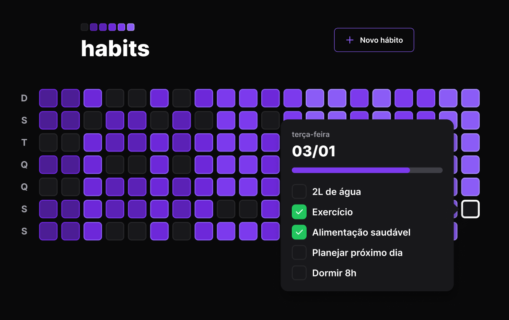
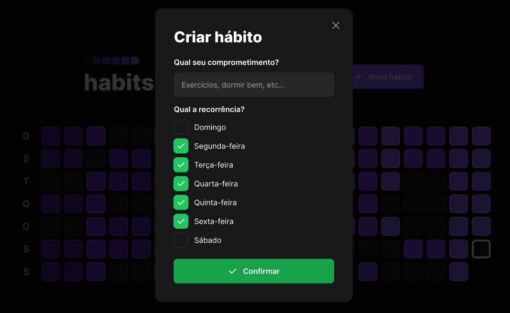
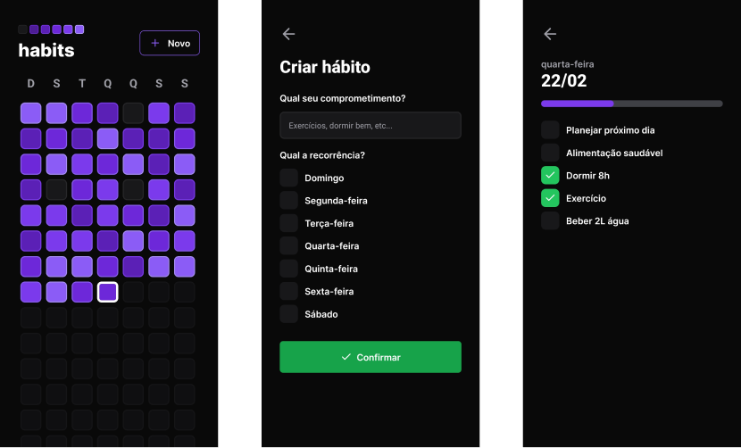

<h1 align="center">
    
</h1>

# Rocketseat's NextLevelWeek #11 :rocket:

This online event, hosted by [Rocketseat](https://rocketseat.com.br/)'s team, happened between January 16 and 22, 2023. 
The focus was create an application from the beggining, fully functional and ready for user's use.
The main technologies used in this project were React, React Native, Node.js, MongoDB and Prisma.

## habits :calendar:

<h1 align="center">
    
</h1>

The _habits_ app, developed by the Rocketseat platform during the Next Level Week #11 event, is a web application designed to help users build positive habits in their daily lives. The app allows users to set goals for themselves and track their progress over time, with a focus on creating sustainable habits rather than short-term changes. 

The app includes features such as daily check-ins, personalized habit suggestions, and a social community for support and motivation. Overall, the _habits_ app represents a powerful tool for anyone looking to improve their daily habits and lead a more productive and fulfilling life.

## Showcase :tv:

Designed to fit in any screen size, the website works perfectly and maintains its dimensions both on smartphones and tablets, as well as notebooks and desktops!

### Screens :desktop_computer:

<h1 align="center">
    
    
</h1>

### Mobile :iphone:

<h1 align="center">
   
</h1>
